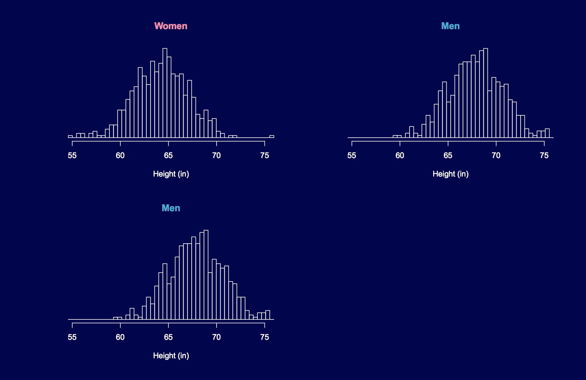
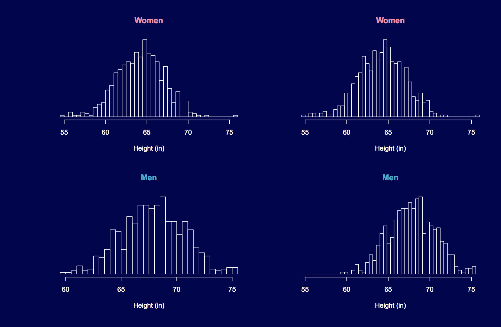
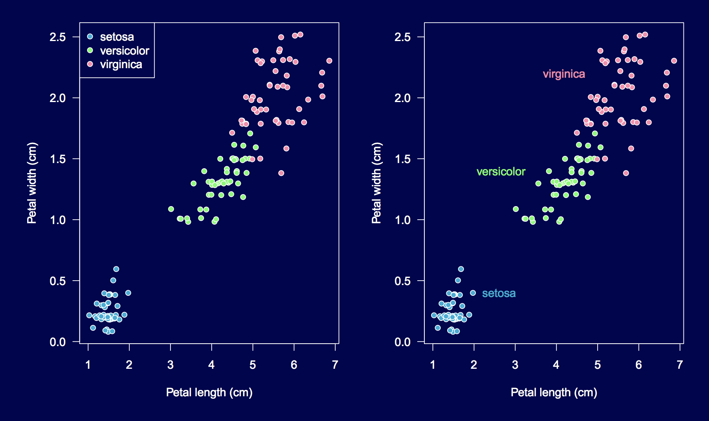
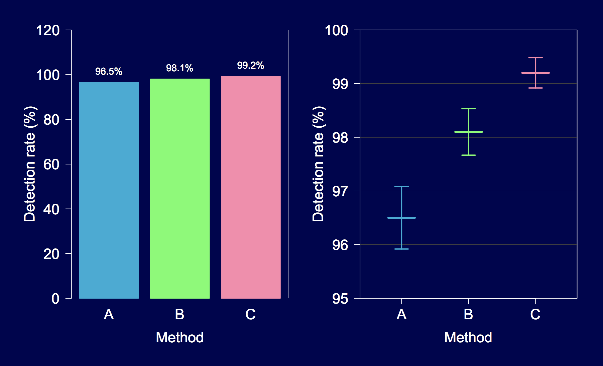

# The giants

Before playing with R or Python, let's go back to the beginning (of viz, that is)

### Edward Tuft (ET)

Perhaps the most cited person on visualizing quantatitive information is [Edward Tuft](https://en.wikipedia.org/wiki/Edward_Tufte), who came from poli-sci and got into viz when tasked with teaching a stats class to journalists in 1975. 

**Wrote [the Visual Display of Quantatative Information](https://www.amazon.com/Visual-Display-Quantitative-Information/dp/0961392142)** (200 pages; $30)

Notable facts:

- Still alive and [teaching workshops](https://www.edwardtufte.com/tufte/courses). "Playing" Texas in Jan.
- He hates powerpoint; [said](https://en.wikipedia.org/wiki/Edward_Tufte#Criticism_of_PowerPoint) it was to blame for the Columbia Space Shuttle [disaster](https://en.wikipedia.org/wiki/Space_Shuttle_Columbia_disaster)

Notable principles:

> Induce the viewer to think about the substance rather than about methodology, graphic design, the tech of graphic production, or something else.

By making our plots too busy, too poorly-scaled, or too 3d-sexy, are we distracting the reader?

More Tuft:

- *Clutter and confusion are failures of design, not attributes of information.*
- *Graphical excellence is that which gives to the viewer the greatest number of ideas in the shortest time with the least ink in the smallest space.*
- *Design cannot rescue failed content.*

### Leland Wilkinson

Leland comes from industry, having worked for SPSS, Tableau. Wrote the textbook [Grammar of Graphics](https://www.amazon.com/Grammar-Graphics-Statistics-Computing/dp/0387245448). Note: this is a *dense* 691 page book; don't start here. $17 for [digital copy](https://www.amazon.com/Grammar-Graphics-Statistics-Computing/dp/0387245448).

Wait a second, isn't grammar about words? From [here](http://byrneslab.net/classes/biol607/readings/wickham_layered-grammar.pdf):

> A grammar of graphics is a tool that enables us to concisely describe the components of a graphic. Such a grammar allows us to move beyond named graphics (e.g., the “scatterplot”) and gain insight into the deep structure that underlies statistical graphics.

Notable facts:

- Leland's still alive, working for [H20.ai](https://www.h2o.ai), which seems similar to [Data Robot](https://www.datarobot.com/)
- Hadley Wickham's [ggplot2](https://github.com/tidyverse/ggplot2) is based on Leland's grammar. For more, see [this](http://byrneslab.net/classes/biol607/readings/wickham_layered-grammar.pdf) 2010 paper by Hadley.
- The idea is to use the grammar to create graphical poems. (Hadley)

### William Cleveland

Professor at Purdue, still alive. First wrote [The Elements of Graphing Data](https://www.amazon.com/Elements-Graphing-Data-William-Cleveland/dp/0963488414/ref=sr_1_4?s=books&ie=UTF8&qid=1512569150&sr=1-4&keywords=william+cleveland) (297 pages; $40 used) and then [Visualizing Data](https://www.amazon.com/Visualizing-Data-William-S-Cleveland/dp/0963488406) (360 pages; $51)

Did a lot of work on best ways designers can encode data for easy decoding. See paper [here](http://info.slis.indiana.edu/~katy/S637-S11/cleveland84.pdf).

Cleveland says people are able to decode these things most accurately (in order). From [here](http://flowingdata.com/2010/03/20/graphical-perception-learn-the-fundamentals-first/):

1. Position along a common scale e.g. scatter plot
2. Position on identical but nonaligned scales e.g. multiple scatter plots
3. Length e.g. bar chart
4. Angle & Slope (tie) e.g. pie chart
5. Area e.g. bubbles
6. Volume, density, and color saturation (tie) e.g. heatmap

# Practical examples

**Note: images come from [Ken Broman](https://www.biostat.wisc.edu/~kbroman/presentations/graphs_cmp2014.pdf)**

### When comparing, align vertically instead of horizontally

### Preserve axes

### Avoid legends

### Carefully handle zero

# Questions

- Has the spread of empiricism in data science gone too far? In other words, are we too focused on results and quick iteration vs learning foundations?

- What effect has Excel had on popular viz?

- What are best practices at your organization?

# Resources

### Books

- [Visual Display of Quantatative Information](https://www.amazon.com/Visual-Display-Quantitative-Information/dp/0961392142) by Edward Tuft; free excerpts [here](https://www.colorado.edu/geography/foote/maps/assign/reading/TufteCoversheet.pdf)
- [Grammar of Graphics](https://www.amazon.com/Grammar-Graphics-Statistics-Computing/dp/0387245448) by Leland Wilkinson
- [Visualizing Data](https://www.amazon.com/Visualizing-Data-William-S-Cleveland/dp/0963488406) by William Cleveland

### Blogs

- [Junk Charts](http://junkcharts.typepad.com) (Thoughtful criticism)
- [Perceptual Edge](http://www.perceptualedge.com) (from BI perspective)
- [Mike Bostock](https://bost.ocks.org/mike/)
- [Flowing data](http://flowingdata.com/)

### Talks

- [How to display data badly by Ken Broman](https://www.biostat.wisc.edu/~kbroman/presentations/graphs_cmp2014.pdf)
- [Behind every great plot there's a great deal of wrangling by Jenny Bryan](https://www.youtube.com/watch?v=4MfUCX_KpdE)
- Most talks from [Plotcon](https://www.youtube.com/results?search_query=plotcon&page=&utm_source=opensearch)
